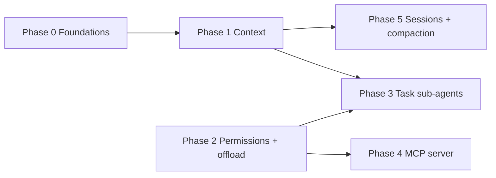

# Claude Code–Style Agent Integration Roadmap

> ⚠️ **Status: Proposal / Roadmap**
>
> This document describes a phased plan to incorporate patterns inspired by Claude Code’s agent architecture (dynamic context, hierarchical instructions, isolated sub-agents, permission gating, result offloading, session compaction). It may reference hypothetical commands or config keys that do not exist yet.
>
> For **current** runtime behavior, see [config-reference.md](../reference/api/config-reference.md), [operations-runbook.md](../ops/operations-runbook.md), and [troubleshooting.md](../ops/troubleshooting.md).

## Purpose

ZeroClaw already provides a Rust-first, lightweight agent runtime (memory RAG, hardware context, delegate agents, MCP consumption, autonomy levels, history pruning). This roadmap connects those pieces into a **refined agentic loop** without abandoning local-first and privacy constraints.

## Baseline (today)

- Orchestration is concentrated in `src/agent/` (including `loop_.rs`); interactive flows use `src/agent/agent.rs` with memory loading and system prompts.
- Per-turn enrichment includes date/time, memory RAG, hardware RAG, tool filters, and approval hooks.
- Delegate-style tooling exists (`src/tools/delegate.rs`, model routing profiles) but is not the same as a fully isolated nested “Task” sub-agent.
- **Persistence is intentionally layered** (not a single blob): interactive CLI uses versioned `SessionRecord` JSON under `~/.zeroclaw/sessions/`; daemon channels keep per-sender turns in memory + optional workspace JSONL (`SessionStore`); gateway uses workspace session backends; optional `[agent.session_transcript]` JSONL is orthogonal. Compaction archives (`sessions/archives/*.jsonl`) back LLM summarization for interactive and channel paths when budgets are exceeded.

## Principles (every phase)

- **One concern per phase** — vertical slices so each PR stays reviewable.
- **Trait boundaries** — prefer a `ContextAssembler` (or similar) over growing monolithic loop code; see [refactor-candidates.md](../maintainers/refactor-candidates.md).
- **Config-gated rollout** — safe defaults; document risk tier per [AGENTS.md](../../AGENTS.md) (tools/gateway/security = higher touch).
- **Privacy** — git status, transcripts, and offloaded blobs stay user-controlled; document anything that leaves the machine (provider API calls).

---

## Phase 0 — Foundations

**Duration (indicative):** 0.5–1 week

**Goal:** Shared types, hooks, and tests so later phases do not duplicate logic.

| Work item | Outcome |
|-----------|---------|
| `ContextLayer` / `ContextFingerprint` model | Describes global → user → workspace → session sources and inputs for memoization invalidation. |
| `ContextAssembler` trait + implementation behind config | Single entry used by CLI, daemon, and gateway paths. |
| Unit tests for git snapshot (mock repo), file layer discovery, fingerprint changes | Regression safety before refactoring `loop_.rs`. |
| Document cache invalidation rules | Avoid stale context. |

**Exit criteria:** Builder callable in tests with deterministic output; default user-visible behavior unchanged (or additive behind a flag).

---

## Phase 1 — Hierarchical + dynamic context (highest ROI)

**Duration (indicative):** 1–2 weeks

**Goal:** Each major model call receives structured, **fresh** context: date/time, optional git summary, layered instruction files, summaries of Skills / MCP / peripherals, with **memoization** keyed by a fingerprint.

| Work item | Notes |
|-----------|--------|
| Module e.g. `src/context/` (`builder`, `git`, `layers`, `memo`) | Centralizes prompt assembly vs. scattered enrichment. |
| Four-level hierarchy for instruction files | Align with `AGENTS.md` / `CLAUDE.md`; optional `CONTEXT.md` for project blocks. |
| Git block: branch, short status, last N commits (configurable; off outside repos) | Dynamic workspace awareness. |
| Injected summaries: Skills, MCP servers, peripherals / boards | Complements existing memory + hardware RAG. |
| Memoization (`once_cell`, `dashmap`, or session cache) with fingerprint invalidation | Avoid redundant work across tool iterations. |
| Wire into system prompt or prefix **per user turn** (configurable, not necessarily every tool step) | Balance freshness vs. tokens. |
| `zeroclaw init` seeds `CLAUDE.md` / `CONTEXT.md` templates | Onboarding parity with common “init” flows. |

**Exit criteria:** Observable richer system context in logs; token/latency notes; fingerprint tests pass.

**Risk:** Medium (behavior change). **Rollback:** config flag to legacy assembly.

---

## Phase 2 — Permission engine + result offloading

**Duration (indicative):** 1–2 weeks

**Goal:** **Allow / ask / deny** per tool or pattern, plus **large-result offload** so shell and fetch tools cannot blow the context window.

| Work item | Notes |
|-----------|--------|
| Extend `AutonomyLevel` or add `PermissionMode` + per-tool matrix | Map existing levels through a deprecation-friendly mapping. |
| Central pre-tool hook: allow, queue approval (dashboard/channel), or deny with structured error | Touches `src/security/**` — ship in small PRs. |
| Offload over threshold (e.g. 10k chars) → `~/.zeroclaw/temp/…`; model sees preview + path/ID | Shared helper for shell, web fetch, large reads. |
| Debug-level logging for offload events | Operations visibility. |

**Exit criteria:** Policy tests; large-output tests; no silent truncation without a recorded reference.

**Risk:** High (security boundary). Treat as careful, reviewed increments.

---

## Phase 3 — Isolated sub-agents (“Task tool”)

**Duration (indicative):** 2–3 weeks

**Goal:** Nested sub-agents with **scoped tools**, **isolated history**, and a **bounded result** back to the parent—reusing delegate concepts without copying the entire loop.

| Work item | Notes |
|-----------|--------|
| `task` / `spawn_task` tool: objective, tool allowlist, optional MCP allowlist, max iterations, parent session ID | Align with `DelegateTool` and delegate profiles in model routing—**consolidate** where possible. |
| Child session / buffer in-process first | Optional process isolation later. |
| Structured return: summary + optional artifact paths | Keeps parent context small. |
| Clarify interaction with Hands / swarm | Document lifecycle in one place. |

**Exit criteria:** E2E test: parent invokes task, child uses subset of tools, parent receives bounded result.

**Risk:** Medium–high. Prefer an `experimental_task_tool` (or similar) flag until stable.

---

## Phase 4 — Bidirectional MCP (ZeroClaw as MCP server)

**Duration (indicative):** 2+ weeks

**Goal:** `zeroclaw mcp serve` over **stdio** and optionally **HTTP**, exposing a **curated** tool surface with JSON Schema.

| Work item | Notes |
|-----------|--------|
| CLI: transport selection (stdio / http) | Follow MCP spec; reuse schema generation from the tool registry. |
| Allowlist — not all tools on by default | Security boundary. |
| HTTP: authentication aligned with gateway patterns | Security review. |
| User docs: Cursor / Claude Desktop one-liner | Reduce support load. |

**Exit criteria:** Manual verification with one external client; contract tests for list + one call.

**Shipped (slice):** `zeroclaw mcp serve` — stdio (default) and **HTTP** (`--transport http`, `POST /mcp`) MCP (`2024-11-05`); curated allowlist via `[mcp_serve]` + `--allow-tool`; optional HTTP `Authorization: Bearer` via `[mcp_serve].auth_token` (non-loopback bind requires a token). Safe default tools (`memory_recall`, `file_read`) unless `relax_tool_policy = true`. Does not re-expose external MCP client tools. User doc: [mcp-serve.md](../mcp-serve.md). Contract tests: `tools/list` + `tools/call` + HTTP router.

**Risk:** High (new attack surface).

---

## Phase 5 — Session persistence + compaction

**Duration (indicative):** 1–2 weeks

**Goal:** Structured transcripts under `~/.zeroclaw/sessions/`, resume by ID, **auto-compaction** of old turns—**unifying** existing compaction hooks in the loop.

| Work item | Notes |
|-----------|--------|
| Versioned session record schema | Enables migrations. |
| Resume path reloads layers + dynamic context | Depends on Phase 1. |
| Compaction job: summarized segments + pointer to full archive | Align with existing `compact_context` / summary behavior. |
| Retention / GC policy | Privacy and disk usage. |

**Started (slice):** Versioned `SessionRecord` in `src/agent/session_record.rs` (v2 on disk, migrates v1 interactive JSON); `SessionCompactionMeta` stores archive-relative paths + last summary excerpt; `auto_compact_history` appends compacted messages to `~/.zeroclaw/sessions/archives/*.jsonl` when the home directory exists.

**Incremental delivery:** Session scope IDs are centralized in [`src/agent/session_record.rs`](../../src/agent/session_record.rs) (CLI `cli:<path>`, gateway memory id + `gw_` workspace backend key, channels `conversation_history_key`). WebSocket `connect` with `session_id` re-hydrates persisted chat and resends `session_start` so SQLite/JSONL history and memory recall stay aligned. Compaction archive retention is opt-in via `[agent] session_archive_retention_days` (default `0`): GC removes aged `archives/*.jsonl` files not listed in any `compaction.archive_paths` under `~/.zeroclaw/sessions/*.json`, runs after interactive compaction, after channel turns that run `auto_compact_history`, and on gateway startup. Unit tests cover archive GC and `ContextAssembler` fingerprint changes when instruction files change (dynamic layer invalidation on resume).

**Channel / daemon parity:** After a successful `run_tool_call_loop`, channels call the same `auto_compact_history` as interactive mode (when `max_history_messages` / `max_context_tokens` are exceeded). User/assistant turns are derived from the in-memory LLM history (tool messages are not persisted to channel session storage), the per-sender cache is replaced, and `SessionStore` is rewritten when session persistence is enabled. On context-window **errors**, the legacy `compact_sender_history` path (truncate recent turns) remains as a fallback. Structured `tracing` logs record estimated token counts before/after LLM compaction when it runs.

**Remaining unification (optional):** `compact_context` / `Agent::trim_history` (gateway `Agent` path) and proactive `proactive_trim_turns` are separate knobs from LLM compaction; consolidating them further would be a follow-up refactor.

**Exit criteria:** Restart and continue session; compaction measurably reduces tokens without losing recoverability (use `tracing` fields `estimated_tokens_before` / `estimated_tokens_after` on the `Session history auto-compaction applied (Phase 5)` event to compare before/after on a live instance).

---

## Cross-cutting work

- Split `agent/loop_.rs` incrementally as modules land (context builder, permission hook, task runner).
- Run `cargo fmt`, `cargo clippy --all-targets -- -D warnings`, `cargo test`; use `./dev/ci.sh all` before merge per [AGENTS.md](../../AGENTS.md).

---

## Dependency graph

- **Phase 1 → 5:** shared “what to load” logic for resume.
- **Phase 2 before 3:** sub-agents inherit policy and offload behavior.
- **Phase 4** can start after Phase 2; full value once policy is clear.

---

## Rough calendar estimates

One senior contributor, focused work; parallel work possible (e.g. Phase 4 spike while Phase 1 stabilizes).

| Phase | Indicative duration |
|-------|---------------------|
| 0 | 0.5–1 week |
| 1 | 1–2 weeks |
| 2 | 1–2 weeks |
| 3 | 2–3 weeks |
| 4 | 2+ weeks |
| 5 | 1–2 weeks |

**Total:** roughly **8–12 weeks** end-to-end.

---

## Related documents

- [Security improvement roadmap](../security/security-roadmap.md) — OS-level containment and security proposals.
- [Change playbooks](./change-playbooks.md) — how to extend providers, channels, tools.
- [Docs contract](./docs-contract.md) — labeling proposal vs runtime-contract docs.

## Localized versions

- [简体中文](../i18n/zh-CN/contributing/claude-code-style-integration-roadmap.zh-CN.md)
- [Tiếng Việt](../vi/claude-code-style-integration-roadmap.md)
