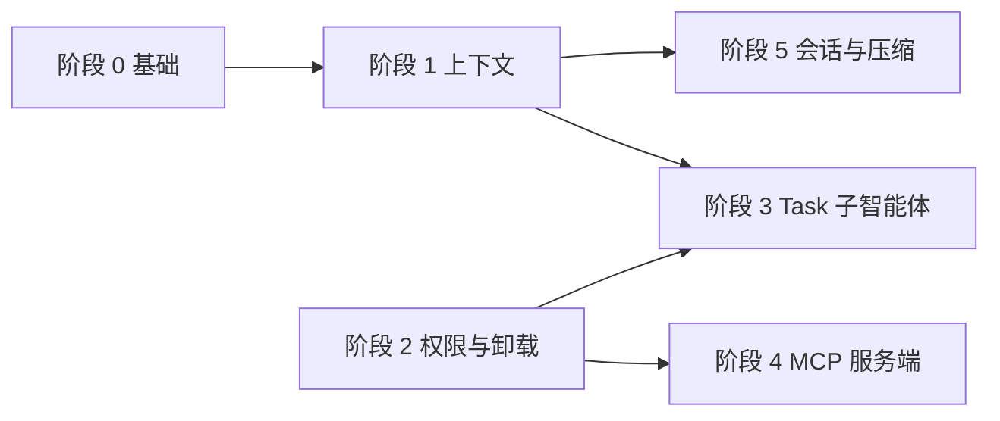

# Claude Code 风格智能体集成路线图

> ⚠️ **状态：提案 / 路线图**
>
> 本文档描述分阶段引入 Claude Code 式智能体架构（动态上下文、分层说明、隔离子智能体、权限门控、结果卸载、会话压缩）的计划，可能提及尚不存在的命令或配置项。
>
> **当前**运行时行为请以 [config-reference.zh-CN.md](../reference/api/config-reference.zh-CN.md)、[operations-runbook.zh-CN.md](../ops/operations-runbook.zh-CN.md) 和 [troubleshooting.zh-CN.md](../ops/troubleshooting.zh-CN.md) 为准。

## 目的

ZeroClaw 已具备 Rust 优先的轻量运行时（记忆 RAG、硬件上下文、委托智能体、MCP 消费、自主级别、历史裁剪）。本路线图在不放弃本地优先与隐私的前提下，将这些能力串联成更**精炼的智能体循环**。

## 现状（基线）

- 编排集中在 `src/agent/`（含 `loop_.rs`）；交互路径使用 `src/agent/agent.rs` 与记忆加载、系统提示。
- 每轮增强包括日期时间、记忆 RAG、硬件 RAG、工具过滤与审批钩子。
- 委托式工具（`src/tools/delegate.rs`、模型路由配置）存在，但与完全隔离的嵌套「Task」子智能体仍有区别。
- **持久化刻意分层**（非单一存储）：交互 CLI 使用 `~/.zeroclaw/sessions/` 下带版本的 `SessionRecord` JSON；守护进程频道将每发送方轮次存于内存 + 可选工作区 JSONL（`SessionStore`）；网关使用工作区会话后端；可选的 `[agent.session_transcript]` JSONL 与之正交。超出预算时，交互与频道路径均可依赖 `sessions/archives/*.jsonl` 支撑 LLM 摘要压缩。

## 各阶段原则

- **每阶段单一主题** — 垂直切片，便于评审。
- **trait 边界** — 倾向引入 `ContextAssembler` 等抽象，避免单文件无限膨胀；见 [refactor-candidates.md](../maintainers/refactor-candidates.zh-CN.md)。
- **配置控制发布** — 默认安全；按 [AGENTS.md](../../../../AGENTS.md) 标注风险（工具/网关/安全属高影响）。
- **隐私** — git 状态、转写、卸载 blob 由用户掌控；明确写出哪些数据会离开本机（如调用模型 API）。

---

## 阶段 0 — 基础

**周期（参考）：** 约 0.5～1 周

**目标：** 共享类型、钩子与测试，避免后续重复逻辑。

| 工作项 | 产出 |
|--------|------|
| `ContextLayer` / `ContextFingerprint` 模型 | 描述全局 → 用户 → 工作区 → 会话层级及备忘失效输入。 |
| `ContextAssembler` trait + 配置后的实现 | CLI、守护进程与网关共用入口。 |
| 针对 git 快照（模拟仓库）、文件层发现、指纹变化的单元测试 | 在重构 `loop_.rs` 前防止回归。 |
| 记录缓存失效规则 | 避免陈旧上下文。 |

**退出标准：** 测试中可确定性调用构建器；默认对用户可见行为无变或仅在开关后增量。

---

## 阶段 1 — 分层 + 动态上下文（投入产出比最高）

**周期（参考）：** 约 1～2 周

**目标：** 每次主要模型调用获得结构化、**新鲜**的上下文：时间、可选 git 摘要、分层说明文件、Skills/MCP/外设**摘要**，并按指纹做**备忘**。

| 工作项 | 说明 |
|--------|------|
| 例如 `src/context/`（`builder`、`git`、`layers`、`memo`） | 集中提示组装，减少分散增强。 |
| 四级说明文件层次 | 与 `AGENTS.md` / `CLAUDE.md` 对齐；可选用 `CONTEXT.md` 承载项目块。 |
| Git 块：分支、简短状态、最近 N 次提交（可配置；非仓库可关闭） | 动态工作区感知。 |
| 注入摘要：Skills、MCP、外设/板卡 | 与现有记忆 + 硬件 RAG 互补。 |
| 备忘（`once_cell`、`dashmap` 或会话缓存）+ 指纹失效 | 减少工具轮次间重复计算。 |
| 接入系统提示或前缀：**每用户轮**（可配置，不必每步工具） | 在新鲜度与 token 间取舍。 |
| `zeroclaw init` 生成 `CLAUDE.md` / `CONTEXT.md` 模板 | 与常见「初始化」流程对齐。 |

**退出标准：** 日志中可见更丰富的系统上下文；记录 token/延迟；指纹测试通过。

**风险：** 中（行为变化）。**回滚：** 配置项切回旧组装逻辑。

---

## 阶段 2 — 权限引擎 + 结果卸载

**周期（参考）：** 约 1～2 周

**目标：** **允许 / 询问 / 拒绝** 按工具或模式；**大块结果卸载**，避免 shell 与拉取类工具撑爆上下文。

| 工作项 | 说明 |
|--------|------|
| 扩展 `AutonomyLevel` 或新增 `PermissionMode` + 每工具矩阵 | 兼容映射现有级别，便于弃用迁移。 |
| 统一工具前钩子：允许、排队审批（面板/频道）、或结构化拒绝 | 涉及 `src/security/**`，小步合并。 |
| 超阈值（如 10k 字符）→ 写入 `~/.zeroclaw/temp/…`；模型仅见预览 + 路径/ID | shell、网页拉取、大文件读等共用助手。 |
| 卸载事件的 debug 级日志 | 运维可见性。 |

**退出标准：** 策略测试；大输出测试；无静默截断而不记录引用。

**风险：** 高（安全边界）。需审慎、可评审的增量。

---

## 阶段 3 — 隔离子智能体（「Task」工具）

**周期（参考）：** 约 2～3 周

**目标：** 嵌套子智能体具备**限定工具**、**隔离历史**、向父级返回**有界结果**—复用委托概念，而非复制整条循环。

| 工作项 | 说明 |
|--------|------|
| `task` / `spawn_task` 工具：目标、工具白名单、可选 MCP 白名单、最大迭代、父会话 ID | 与 `DelegateTool` 与路由中的委托配置**合并**重复逻辑。 |
| 子会话 / 缓冲优先进程内 | 进程级隔离可后续再做。 |
| 结构化返回：摘要 + 可选产物路径 | 控制父上下文体积。 |
| 与 Hands / 群体协同的交互 | 生命周期集中在一处文档说明。 |

**退出标准：** E2E：父调用 task，子仅用子集工具，父收到有界结果。

**风险：** 中高。稳定前可用 `experimental_task_tool` 等开关。

---

## 阶段 4 — 双向 MCP（ZeroClaw 作为 MCP 服务端）

**周期（参考）：** 2 周以上

**目标：** `zeroclaw mcp serve` 支持 **stdio** 与可选 **HTTP**，暴露**精选**工具面与 JSON Schema。

| 工作项 | 说明 |
|--------|------|
| CLI：传输方式（stdio / http） | 遵循 MCP 规范；从工具注册表复用 schema 生成。 |
| 能力白名单 — 默认不暴露全部工具 | 安全边界。 |
| HTTP：与网关模式对齐的鉴权 | 安全评审。 |
| 用户文档：Cursor / Claude Desktop 一行命令 | 降低支持成本。 |

**退出标准：** 在外部客户端上手测；列表 + 单次调用的契约测试。

**已交付（切片）：** `zeroclaw mcp serve` — 默认 stdio 与 **HTTP**（`--transport http`、`POST /mcp`）MCP（`2024-11-05`）；通过 `[mcp_serve]` 与 `--allow-tool` 白名单；HTTP 可选 `Authorization: Bearer`（`[mcp_serve].auth_token`；非回环绑定需 token）。默认仅安全只读工具（`memory_recall`、`file_read`），除非 `relax_tool_policy = true`。不反向暴露外部 MCP 客户端工具。用户文档：[mcp-serve.md](../../../mcp-serve.md)。契约测试：`tools/list`、`tools/call` 与 HTTP 路由。

**风险：** 高（新攻击面）。

---

## 阶段 5 — 会话持久化 + 压缩

**周期（参考）：** 约 1～2 周

**目标：** `~/.zeroclaw/sessions/` 下结构化转写、按 ID 恢复、旧轮次**自动压缩**—**统一**循环内已有压缩钩子。

| 工作项 | 说明 |
|--------|------|
| 带版本字段的会话记录 schema | 便于迁移。 |
| 恢复路径重新加载分层与动态上下文 | 依赖阶段 1。 |
| 压缩任务：摘要段 + 完整归档指针 | 与现有 `compact_context` / 摘要行为对齐。 |
| 保留 / GC 策略 | 隐私与磁盘。 |

**已开始（切片）：** 版本化 `SessionRecord`（磁盘 v2，自交互 JSON v1 迁移）、`SessionCompactionMeta`（归档相对路径与摘要摘录）、压缩时将片段写入 `~/.zeroclaw/sessions/archives/*.jsonl`（若存在主目录）。

**增量交付：** 会话作用域 ID 已集中在 `session_record.rs`（CLI `cli:<路径>`、网关 memory id + 工作区 `gw_` 后端键、频道 `conversation_history_key`）。WebSocket `connect` 携带 `session_id` 时会重新加载持久化对话并再次发送 `session_start`，使 SQLite/JSONL 历史与记忆召回一致。压缩归档保留策略为可选：`[agent] session_archive_retention_days`（默认 `0`）会在交互式压缩后、在运行 `auto_compact_history` 的频道轮次之后及网关启动时清理过期的 `archives/*.jsonl`，且跳过仍列在 `~/.zeroclaw/sessions/*.json` 中 `compaction.archive_paths` 的路径。单元测试覆盖归档 GC，以及指令文件变更时 `ContextAssembler` 指纹变化（恢复时动态层失效）。

**频道 / 守护进程对齐：** `run_tool_call_loop` 成功后，频道在超出 `max_history_messages` / `max_context_tokens` 时调用与交互模式相同的 `auto_compact_history`。从内存中的 LLM 历史提取用户/助手轮次（工具消息不写入频道会话存储），替换每发送方缓存，并在启用会话持久化时重写 `SessionStore`。上下文窗口**报错**时仍沿用 `compact_sender_history`（截断最近轮次）作为兜底。启用 LLM 压缩时会通过结构化 `tracing` 记录压缩前后估算 token。

**剩余统一工作（可选）：** `compact_context` / `Agent::trim_history`（网关 `Agent` 路径）与主动 `proactive_trim_turns` 仍是独立于 LLM 压缩的开关；进一步合并属后续重构。

**退出标准：** 中断后可续聊；压缩可度量降低 token 且不丢失可恢复性（可在实例上对比 `Session history auto-compaction applied (Phase 5)` 事件中的 `estimated_tokens_before` / `estimated_tokens_after`）。

---

## 横切工作

- 随模块落地逐步拆分 `agent/loop_.rs`（上下文构建、权限钩子、任务运行器）。
- 合并前运行 `cargo fmt`、`cargo clippy --all-targets -- -D warnings`、`cargo test`；推荐使用 `./dev/ci.sh all`，见 [AGENTS.md](../../../../AGENTS.md)。

---

## 依赖关系

- **阶段 1 → 5：** 恢复会话与「加载什么」共享逻辑。
- **阶段 2 先于 3：** 子智能体继承策略与卸载。
- **阶段 4** 可在阶段 2 后开始；策略清晰后价值更高。

---

## 粗略排期

一名资深贡献者、专注投入；可并行（例如阶段 1 稳定同时做阶段 4 预研）。

| 阶段 | 参考周期 |
|------|----------|
| 0 | 0.5～1 周 |
| 1 | 1～2 周 |
| 2 | 1～2 周 |
| 3 | 2～3 周 |
| 4 | 2 周以上 |
| 5 | 1～2 周 |

**合计：** 约 **8～12 周**。

---

## 相关文档

- [安全改进路线图](../security/security-roadmap.zh-CN.md)
- [变更手册](./change-playbooks.zh-CN.md)
- [文档体系约定](./docs-contract.zh-CN.md)

## 其他语言版本

- [English](../../../contributing/claude-code-style-integration-roadmap.md)
- [Tiếng Việt](../../../vi/claude-code-style-integration-roadmap.md)
