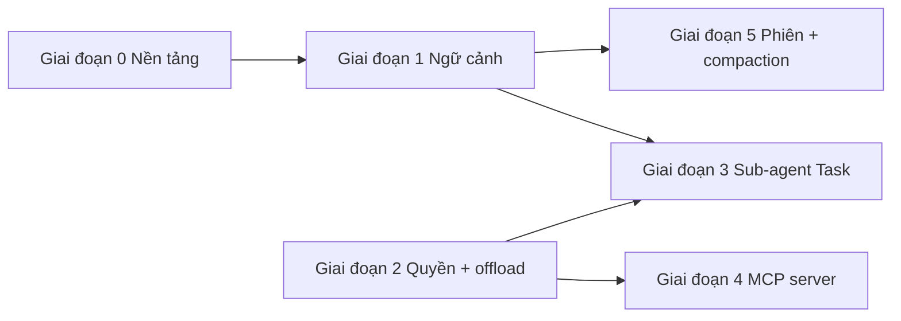

# Lộ trình tích hợp agent kiểu Claude Code

> ⚠️ **Trạng thái: Đề xuất / Lộ trình**
>
> Tài liệu này mô tả kế hoạch theo giai đoạn để áp dụng các mẫu lấy cảm hứng từ kiến trúc agent của Claude Code (ngữ cảnh động, hướng dẫn phân cấp, sub-agent cô lập, kiểm soát quyền, offload kết quả, nén phiên). Có thể đề cập lệnh hoặc khóa cấu hình giả định chưa tồn tại.
>
> Hành vi **hiện tại** của runtime: xem [config-reference.md](config-reference.md), [operations-runbook.md](operations-runbook.md) và [troubleshooting.md](troubleshooting.md).

## Mục đích

ZeroClaw đã có runtime nhẹ ưu tiên Rust (RAG bộ nhớ, ngữ cảnh phần cứng, delegate agent, tiêu thụ MCP, mức tự chủ, cắt tỉa lịch sử). Lộ trình này kết nối các phần đó thành **vòng agent tinh chỉnh hơn** mà không bỏ mô hình local-first và quyền riêng tư.

## Hiện trạng

- Điều phối tập trung ở `src/agent/` (gồm `loop_.rs`); luồng tương tác dùng `src/agent/agent.rs` với tải bộ nhớ và system prompt.
- Mỗi lượt làm giàu có ngày/giờ, RAG bộ nhớ, RAG phần cứng, lọc công cụ và hook phê duyệt.
- Công cụ kiểu delegate (`src/tools/delegate.rs`, profile định tuyến model) đã có nhưng chưa tương đương sub-agent “Task” lồng nhau hoàn toàn cô lập.
- **Persistence được thiết kế theo lớp** (không phải một blob duy nhất): CLI tương tác dùng `SessionRecord` JSON có phiên bản dưới `~/.zeroclaw/sessions/`; kênh daemon giữ lượt theo người gửi trong RAM + JSONL workspace tùy chọn (`SessionStore`); gateway dùng backend phiên workspace; `[agent.session_transcript]` JSONL tùy chọn là kênh độc lập. Khi vượt ngân sách, đường dẫn tóm tắt LLM có thể dùng `sessions/archives/*.jsonl` cho cả CLI và kênh.

## Nguyên tắc (mọi giai đoạn)

- **Một chủ đề mỗi giai đoạn** — lát cắt dọc để PR dễ review.
- **Ranh giới trait** — ưu tiên `ContextAssembler` (hoặc tương tự) thay vì phình một file vòng lặp; xem [refactor-candidates.md](../maintainers/refactor-candidates.md).
- **Triển khai theo cờ cấu hình** — mặc định an toàn; ghi rõ mức rủi ro theo [AGENTS.md](../../AGENTS.md) (công cụ/gateway/bảo mật = tác động cao).
- **Quyền riêng tư** — trạng thái git, transcript, blob offload thuộc kiểm soát người dùng; ghi rõ dữ liệu nào rời máy (gọi API provider).

---

## Giai đoạn 0 — Nền tảng

**Thời gian (ước lượng):** 0,5–1 tuần

**Mục tiêu:** Kiểu dùng chung, hook và test để các giai đoạn sau không trùng logic.

| Hạng mục | Kết quả |
|----------|---------|
| Mô hình `ContextLayer` / `ContextFingerprint` | Mô tả global → user → workspace → session và đầu vào làm mất hiệu lực memo. |
| Trait `ContextAssembler` + triển khai sau cờ cấu hình | Một điểm vào cho CLI, daemon, gateway. |
| Unit test cho snapshot git (repo giả), khám phá lớp file, đổi fingerprint | An toàn hồi quy trước khi refactor `loop_.rs`. |
| Tài liệu quy tắc invalidate cache | Tránh ngữ cảnh cũ. |

**Tiêu chí thoát:** Builder gọi được trong test với đầu ra xác định; hành vi người dùng mặc định không đổi (hoặc chỉ thêm sau cờ).

---

## Giai đoạn 1 — Phân cấp + ngữ cảnh động (ROI cao nhất)

**Thời gian (ước lượng):** 1–2 tuần

**Mục tiêu:** Mỗi lần gọi model chính nhận ngữ cảnh có cấu trúc, **mới**: thời gian, tóm tắt git tùy chọn, file hướng dẫn phân lớp, tóm tắt Skills/MCP/thiết bị ngoại vi, **memo** theo fingerprint.

| Hạng mục | Ghi chú |
|----------|---------|
| Module ví dụ `src/context/` (`builder`, `git`, `layers`, `memo`) | Gom ghép prompt thay vì rải rác. |
| Bốn cấp file hướng dẫn | Khớp `AGENTS.md` / `CLAUDE.md`; tùy chọn `CONTEXT.md` cho khối dự án. |
| Khối git: nhánh, trạng thái ngắn, N commit gần (cấu hình; tắt ngoài repo) | Nhận thức workspace động. |
| Tóm tắt chèn: Skills, MCP, board/thiết bị | Bổ sung cho RAG bộ nhớ + phần cứng hiện có. |
| Memo (`once_cell`, `dashmap`, hoặc cache phiên) + invalidate fingerprint | Giảm tính toán dư giữa các bước công cụ. |
| Nối vào system prompt hoặc tiền tố **mỗi lượt người dùng** (cấu hình, không nhất thiết mỗi bước công cụ) | Cân bằng độ mới và token. |
| `zeroclaw init` tạo mẫu `CLAUDE.md` / `CONTEXT.md` | Onboarding kiểu “init” phổ biến. |

**Tiêu chí thoát:** Log thể hiện system context phong phú hơn; ghi chú token/độ trễ; test fingerprint pass.

**Rủi ro:** Trung bình (đổi hành vi). **Rollback:** cờ cấu hình về lắp ráp cũ.

---

## Giai đoạn 2 — Engine quyền + offload kết quả

**Thời gian (ước lượng):** 1–2 tuần

**Mục tiêu:** **Cho phép / hỏi / từ chối** theo công cụ hoặc pattern; **offload** kết quả lớn để shell và fetch không làm vỡ cửa sổ ngữ cảnh.

| Hạng mục | Ghi chú |
|----------|---------|
| Mở rộng `AutonomyLevel` hoặc thêm `PermissionMode` + ma trận theo công cụ | Ánh xạ mức hiện có, đường deprecate thân thiện. |
| Hook trước công cụ tập trung: cho phép, xếp hàng phê duyệt (dashboard/kênh), hoặc từ chối có cấu trúc | Chạm `src/security/**` — PR nhỏ. |
| Ngưỡng (ví dụ 10k ký tự) → `~/.zeroclaw/temp/…`; model chỉ thấy preview + đường dẫn/ID | Helper dùng chung cho shell, web fetch, đọc lớn. |
| Log mức debug cho sự kiện offload | Khả năng quan sát vận hành. |

**Tiêu chí thoát:** Test chính sách; test đầu ra lớn; không cắt im lặng mà không có tham chiếu.

**Rủi ro:** Cao (ranh giới bảo mật).

---

## Giai đoạn 3 — Sub-agent cô lập (công cụ “Task”)

**Thời gian (ước lượng):** 2–3 tuần

**Mục tiêu:** Sub-agent lồng nhau với **tập công cụ giới hạn**, **lịch sử tách**, **kết quả giới hạn** trả về parent—tái sử dụng delegate mà không nhân đôi toàn bộ vòng lặp.

| Hạng mục | Ghi chú |
|----------|---------|
| Công cụ `task` / `spawn_task`: mục tiêu, allowlist công cụ, allowlist MCP tùy chọn, max iteration, ID phiên parent | **Hợp nhất** với `DelegateTool` và profile delegate trong routing. |
| Phiên / buffer con trong process trước | Cô lập process có thể để sau. |
| Trả về có cấu trúc: tóm tắt + đường dẫn artifact tùy chọn | Giữ ngữ cảnh parent nhỏ. |
| Làm rõ tương tác với Hands/swarm | Một tài liệu vòng đời. |

**Tiêu chí thoát:** E2E: parent gọi task, con dùng tập con công cụ, parent nhận kết quả giới hạn.

**Rủi ro:** Trung bình–cao. Cờ `experimental_task_tool` (hoặc tương tự) cho đến khi ổn định.

---

## Giai đoạn 4 — MCP hai chiều (ZeroClaw là MCP server)

**Thời gian (ước lượng):** 2+ tuần

**Mục tiêu:** `zeroclaw mcp serve` qua **stdio** và tùy chọn **HTTP**, expose bề mặt công cụ **được chọn** với JSON Schema.

| Hạng mục | Ghi chú |
|----------|---------|
| CLI: chọn transport (stdio / http) | Theo spec MCP; tái dùng sinh schema từ registry. |
| Allowlist — không mặc định mở hết công cụ | Ranh giới bảo mật. |
| HTTP: xác thực theo mẫu gateway | Review bảo mật. |
| Tài liệu người dùng: một dòng cho Cursor / Claude Desktop | Giảm hỗ trợ. |

**Tiêu chí thoát:** Kiểm thử thủ công với một client ngoài; test hợp đồng list + một lần gọi.

**Đã giao (lát cắt):** `zeroclaw mcp serve` — MCP stdio (mặc định) và **HTTP** (`--transport http`, `POST /mcp`) (`2024-11-05`); allowlist qua `[mcp_serve]` và `--allow-tool`; HTTP tùy chọn `Authorization: Bearer` qua `[mcp_serve].auth_token` (bind không loopback cần token). Mặc định chỉ công cụ đọc an toàn (`memory_recall`, `file_read`) trừ khi `relax_tool_policy = true`. Không proxy lại công cụ từ MCP client bên ngoài. Tài liệu: [mcp-serve.md](../../mcp-serve.md). Kiểm thử contract: `tools/list` + `tools/call` + HTTP router.

**Rủi ro:** Cao (bề mặt tấn công mới).

---

## Giai đoạn 5 — Persistence phiên + compaction

**Thời gian (ước lượng):** 1–2 tuần

**Mục tiêu:** Transcript có cấu trúc dưới `~/.zeroclaw/sessions/`, tiếp tục theo ID, **tự động nén** lượt cũ—**thống nhất** hook compaction hiện có trong vòng lặp.

| Hạng mục | Ghi chú |
|----------|---------|
| Schema bản ghi phiên có phiên bản | Cho migration. |
| Đường resume tải lại lớp + ngữ cảnh động | Phụ thuộc giai đoạn 1. |
| Job compaction: đoạn tóm tắt + con trỏ tới archive đầy đủ | Khớp `compact_context` / hành vi tóm tắt hiện có. |
| Chính sách retention / GC | Quyền riêng tư và đĩa. |

**Đã bắt đầu (lát cắt):** `SessionRecord` có phiên bản (v2 trên đĩa, migrate từ JSON tương tác v1), `SessionCompactionMeta` (đường dẫn tương đối tới archive + đoạn tóm tắt), compaction ghi JSONL vào `~/.zeroclaw/sessions/archives/*.jsonl` khi có home.

**Giao thêm từng phần:** ID phạm vi phiên được gom trong `session_record.rs` (CLI `cli:<path>`, gateway memory id + khóa backend `gw_` trong workspace, kênh `conversation_history_key`). WebSocket `connect` có `session_id` tải lại lịch sử đã lưu và gửi lại `session_start` để SQLite/JSONL và memory khớp. Giữ archive compaction là tùy chọn: `[agent] session_archive_retention_days` (mặc định `0`) chạy GC sau compaction tương tác, sau các lượt kênh chạy `auto_compact_history`, và khi gateway khởi động; bỏ qua đường dẫn vẫn nằm trong `compaction.archive_paths` của `~/.zeroclaw/sessions/*.json`. Unit test cho GC archive và thay đổi fingerprint `ContextAssembler` khi đổi file hướng dẫn.

**Đối sánh kênh / daemon:** Sau `run_tool_call_loop` thành công, kênh gọi cùng `auto_compact_history` như chế độ tương tác khi vượt `max_history_messages` / `max_context_tokens`. Trích user/assistant từ lịch sử LLM trong RAM (không lưu tin nhắn công cụ vào session kênh), thay cache theo người gửi, và `rewrite_session` khi bật persistence. Khi lỗi vượt context, vẫn dùng `compact_sender_history` làm dự phòng. Log `tracing` ghi `estimated_tokens_before` / `estimated_tokens_after` khi nén LLM chạy.

**Thống nhất còn lại (tùy chọn):** `compact_context` / `Agent::trim_history` và `proactive_trim_turns` vẫn tách khỏi nén LLM; gộp thêm là refactor sau.

**Tiêu chí thoát:** Khởi động lại và tiếp tục phiên; compaction giảm token đo được mà vẫn khôi phục được (so sánh các trường `estimated_tokens_before` / `estimated_tokens_after` trên sự kiện `Session history auto-compaction applied (Phase 5)`).

---

## Công việc xuyên suốt

- Tách `agent/loop_.rs` dần khi module mới vào (builder ngữ cảnh, hook quyền, runner task).
- Chạy `cargo fmt`, `cargo clippy --all-targets -- -D warnings`, `cargo test`; `./dev/ci.sh all` trước merge theo [AGENTS.md](../../AGENTS.md).

---

## Đồ thị phụ thuộc

---

## Ước lượng lịch

Một contributor cấp cao, tập trung; có thể song song (ví dụ spike giai đoạn 4 khi giai đoạn 1 ổn).

| Giai đoạn | Thời gian tham chiếu |
|-----------|----------------------|
| 0 | 0,5–1 tuần |
| 1 | 1–2 tuần |
| 2 | 1–2 tuần |
| 3 | 2–3 tuần |
| 4 | 2+ tuần |
| 5 | 1–2 tuần |

**Tổng:** khoảng **8–12 tuần**.

---

## Tài liệu liên quan

- [Lộ trình cải thiện bảo mật](security-roadmap.md)
- [Change playbooks](../contributing/change-playbooks.md)
- [Docs contract](../contributing/docs-contract.md)

## Bản ngôn ngữ khác

- [English](../contributing/claude-code-style-integration-roadmap.md)
- [简体中文](../i18n/zh-CN/contributing/claude-code-style-integration-roadmap.zh-CN.md)
